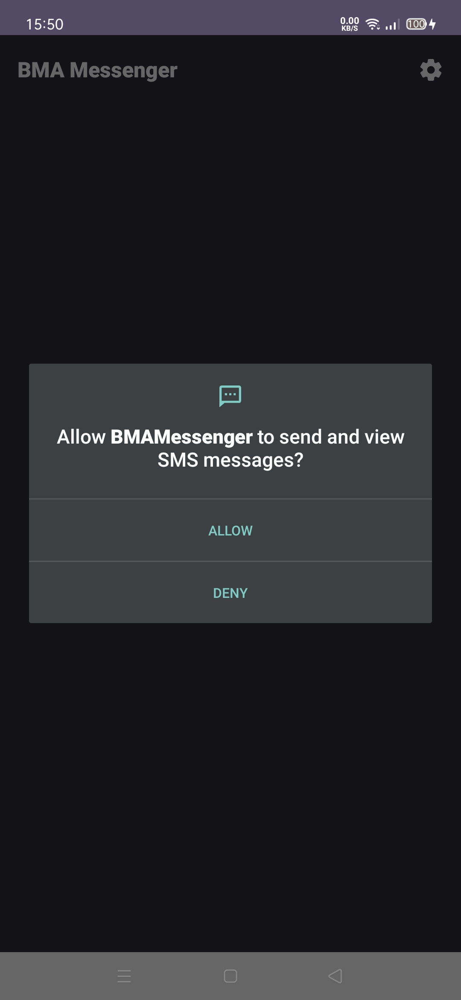
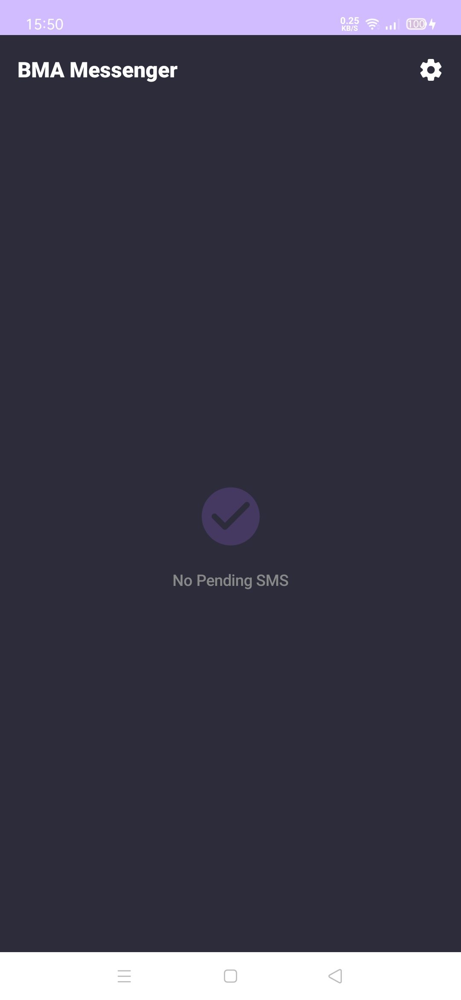
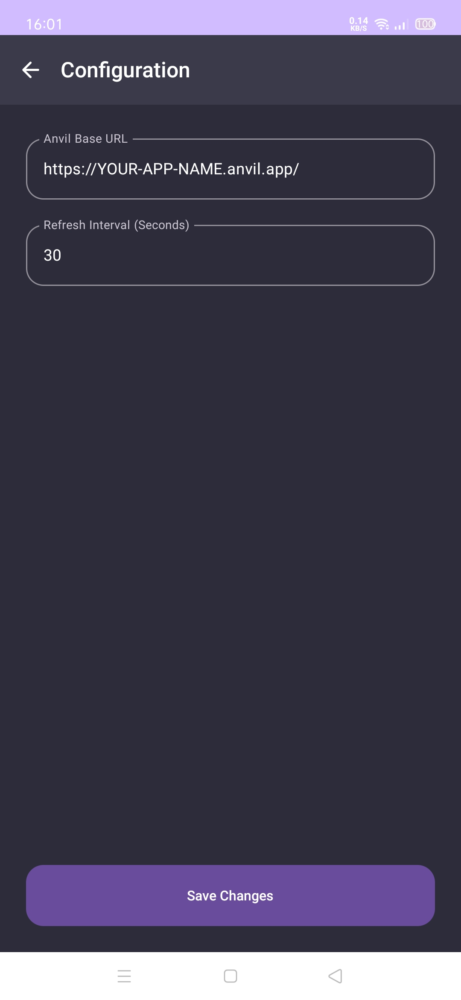
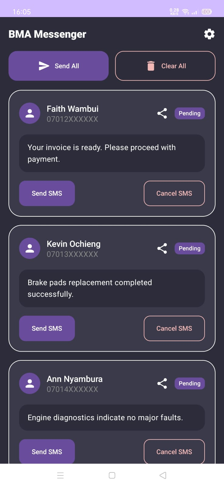
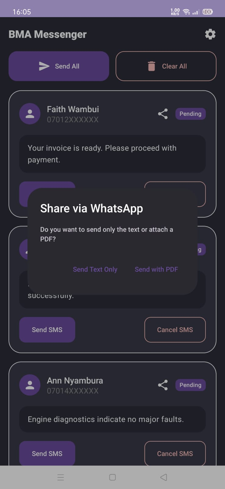

# BMA Messenger

BMA Messenger is an Android application that allows users to send SMS messages and share PDF documents via WhatsApp (tested on version 2.26.5.74). The application is built with modern Android development technologies, including Jetpack Compose, Retrofit, and Coroutines.

## 🚀 Getting Started

Follow these steps to get the project up and running on your local machine.

### Prerequisites
- **Android Studio** (Ladybug or newer recommended)
- **Android Device** with an active SIM card (for SMS functionality)
- **Anvil Account** to host the Python backend
- **Python 3.10+** (if running the Uplink locally)

## Installation & Setup

 ### Clone the Repository
   ```bash
   git clone https://github.com/realrkm/bmamessenger.git
   cd bma-messenger
   ```

## Backend Setup

The backend for this application is powered by Anvil, a platform for building web apps with nothing but Python. Python version 3.10.4 was used for testing and running the application.

### Anvil Uplink Installation

Install the Anvil Uplink library to connect your local Python code to the Anvil service.

### For Windows:

```bash
python -m pip install anvil-uplink==0.6.0
```

### Backend Endpoints

The following Python code snippets detail the HTTP endpoints used by the BMA Messenger application. You will need to add this code to your Anvil server module.

#### Get Pending SMS

This endpoint retrieves all SMS messages from the database that are flagged as not yet sent.

-   **Endpoint:** `GET /pending-sms`
-   **Usage:** The Android app calls this endpoint to fetch the list of pending SMS messages to display on the main screen.

```python
@anvil.server.http_endpoint('/pending-sms', methods=["GET"])
def get_pending_sms():
    with db_cursor() as cursor:
        # We only fetch records where flag is True (1)
        query = "SELECT id, fullname, phone, message, jobcardrefid FROM tbl_sms WHERE flag = True"
        cursor.execute(query)
        rows = cursor.fetchall()
        
        # Convert tuples/dictionaries to a clean list for Android
        pending_messages = []
        for row in rows:
            pending_messages.append({
                "id": row[0] if isinstance(row, tuple) else row['id'],
                "fullname": row[1] if isinstance(row, tuple) else row["fullname"],
                "phone": row[2] if isinstance(row, tuple) else row['phone'],
                "message": row[3] if isinstance(row, tuple) else row['message'],
                "jobcardrefid": row[4] if isinstance(row, tuple) else row['jobcardrefid'],
                "flag": True # Always true because of our SQL filter
            })
        return pending_messages
```

#### Mark SMS as Sent

This endpoint marks a specific SMS message as sent in the database.

-   **Endpoint:** `POST /mark-sent/:msg_id`
-   **Usage:** After an SMS is successfully sent from the Android app, it calls this endpoint to update the message's status on the backend.

```python
@anvil.server.http_endpoint('/mark-sent/:msg_id', methods=["POST"])
def mark_sms_sent(msg_id, **kwargs):
    with db_cursor() as cursor:
        query = "UPDATE tbl_sms SET flag = False WHERE id = %s"
        cursor.execute(query, (int(msg_id),))
    return {"status": "success"}
```

#### Generate PDF

This endpoint generates a PDF document for a given job card ID.

-   **Endpoint:** `GET /generate-pdf/:jobcardid`
-   **Usage:** When the user chooses to share a PDF via WhatsApp, the app calls this endpoint to retrieve the generated document.

```python
@anvil.server.http_endpoint('/generate-pdf/:jobcardid', methods=["GET"])
def generate_pdf(jobcardid, **kwargs):
    try:
        # Convert the string from the URL to an integer before passing it
        job_id_int = int(jobcardid)
        
        # This will return the anvil.media object directly to the HTTP response
        media_object = createQuotationInvoicePdf(job_id_int, "Invoice")
        return media_object
        
    except ValueError:
        return anvil.server.HttpResponse(400, "Invalid JobCard ID format.")
    except Exception as e:
        # Good practice to catch generation errors so the app knows it failed
        return anvil.server.HttpResponse(500, f"PDF Generation failed: {str(e)}")
```


**Android App Configuration**

1. Open the project in Android Studio.
2. Wait for Gradle to sync all dependencies.
3. Run the app on your physical device.
4. Go to Settings within the app and enter your Anvil Base URL (e.g., https://your-app.anvil.app).

**Permissions**

Upon first launch, the app will request SEND_SMS permissions. Ensure you Accept to enable the core messaging features.

## Features

-   **Send SMS:** Send individual or bulk SMS messages.
-   **Share PDF:** Generate and share PDF documents via WhatsApp.
-   **Dark Theme:** A modern, dark theme for a great user experience.
-   **Pull to Refresh:** Refresh the list of pending SMS messages with a simple pull-down gesture.
-   **Settings:** Configure the Anvil base URL and refresh interval.

## Screenshots

1.  **Accept SMS permission**

    

2.  **Display without SMS messages.**

    
    
3.  **Configure Anvil Base Url and Refresh interval under Settings.**

    
   
4.  **Messages loaded in the app.**

    

5.  **Share message or PDF via WhatsApp.**

    

## Technologies Used

-   **UI:**
    -   [Jetpack Compose](https://developer.android.com/jetpack/compose) for building the user interface.
    -   [Material 3](https://m3.material.io/) for the design system.
-   **Networking:**
    -   [Retrofit](https://square.github.io/retrofit/) for making API calls to the Anvil server.
    -   [OkHttp](https://square.github.io/okhttp/) as the HTTP client.
-   **Asynchronous Programming:**
    -   [Kotlin Coroutines](https://kotlinlang.org/docs/coroutines-overview.html) for managing background threads.
-   **Data Persistence:**
    -   [DataStore](https://developer.android.com/topic/libraries/architecture/datastore) for storing settings.

## Dependencies

-   `androidx.core:core-ktx`
-   `androidx.lifecycle:lifecycle-runtime-ktx`
-   `androidx.activity:activity-compose`
-   `androidx.compose.ui:ui`
-   `androidx.compose.ui:ui-graphics`
-   `androidx.compose.ui:ui-tooling-preview`
-   `androidx.compose.material3:material3`
-   `androidx.compose.material3:material3-pull-to-refresh`
-   `junit:junit`
-   `androidx.test.ext:junit`
-   `androidx.test.espresso:espresso-core`
-   `androidx.compose.ui:ui-test-junit4`
-   `androidx.compose.ui:ui-tooling`
-   `androidx.compose.ui:ui-test-manifest`
-   `com.squareup.retrofit2:retrofit`
-   `com.squareup.retrofit2:converter-gson`
-   `androidx.lifecycle:lifecycle-viewmodel-compose`
-   `androidx.datastore:datastore-preferences`

